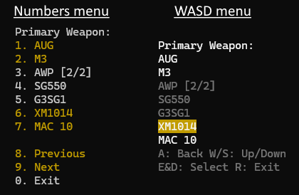

# UniversalMenuAPI

A universal API for CounterStrikeSharp plugins to implement or use.

There exists 2 scenarios:

- You're hosting a server: you want all plugins to have a congruent interface;
  plugins should not clash when multiple concurrent menus are created.
  you want to pick the style of menus presented to players, WASD, numbers, chat, console, etc, or allow the player to pick their preference.
- You're writing a plugin: you likely want to create a menu and present it to the player, you really just want to ask something to make you a menu without taking authority over
any menu system.

This interface aims to act as the intermediary between these two scenarios.

## Sample implementations

Some very simple, but feature complete, menus have been implemented as a proof of concept test and to act as reference.

These samples render to the console in a very trivial fashion.

Press the <kbd>Y</kbd> key to open "chat". There are currently the following commands:

| Command |   |
|---------|---|
| `!menu` | Opens a menu allowing you to switch between number and WASD menus |
| `!guns` | Opens a guns menu similar to CSS/CSGO DM servers |
| `!admin` | Opens an admin menu similar to sm_admin/SimpleAdmin |



## Concerns & to do

- Fragmentation: https://xkcd.com/927/
  - Create source and destination adapters for existing interfaces in this project
  - Push for native support in existing plugin interactions
  - Push for native support in existing menu implementations
  - Check every use case for plugins wanting to create menus is supported via the API, or an extension
    - See `IMenuPriorityExtension` and `IMenuItemSubtitleExtension` as examples for exposing extra functionality
- Interface is agnostic to menu type
  - What use case is this not from a preference?
  - Is there any way we can have multiple different implementations side by side?
- Why is there no "broadcast" API?
  Complexities over navigation can be eliminated by forcing a menu to be created per player
  It also raises questions over expected behavior. Instead encode that behavior in the plugin as desired.
  Object pooling should be done if there are concerns over memory allocations and GC pauses. As an example of some nonsense that can be expressed in the API when global menus come into play are:

  - What would `IsFocused` mean? Another menu could have taken precedence for some players.
  - What would `IsActive` mean? Different players could have closed the menu.

  It is possible there is room for an additional `IGlobalMenu` and `IMenuAPI.CreateGlobalMenu(IReadOnlyList<CCSPlayerController>? players = null)` API,
  which does not support parents, active/focus queries, and such.


### API a little verbose?

By limiting surface area of the API, it makes it harder to abuse, and easier to amend or extend it in future.
It is expected that consumers of this API build their own internal extension methods if they want less verbosity,
rather than causing complexities in the interface.

You can tailor your extension methods to be as concise or verbose as is appropriate for you.
In the proof of concept sample, the `!admin` menu is set up with a very concise example.

```cs
API.CreateAndShowMenu(player, new("Admin")
{
	new("Players Manage")
	{
		new("Slap", players: Players)
		{
			new("0hp", exit: false),
			new("1hp", exit: false),
			new("10hp", exit: false),
			new("100hp", exit: false),
		},
	},
	new("Server Manage"),
	new("Fun Commands")
	{
		new("God Mode", players: Players),
		new("No Clip", players: Players),
		new("Respawn", players: Players),
		new("Give Weapon", players: Players)
		{
			new("AK47"),
			new("M4"),
			new("Deagle"),
		},
	},
	new("Admins Manage"),
});
```

But you could go as simple as this, if being just a little less verbose suffices:

```cs
var menu = API.CreateMenu(player);
menu.AddItem("Test", (menuItem) => Console.WriteLine("Test"));
menu.Display();
```
